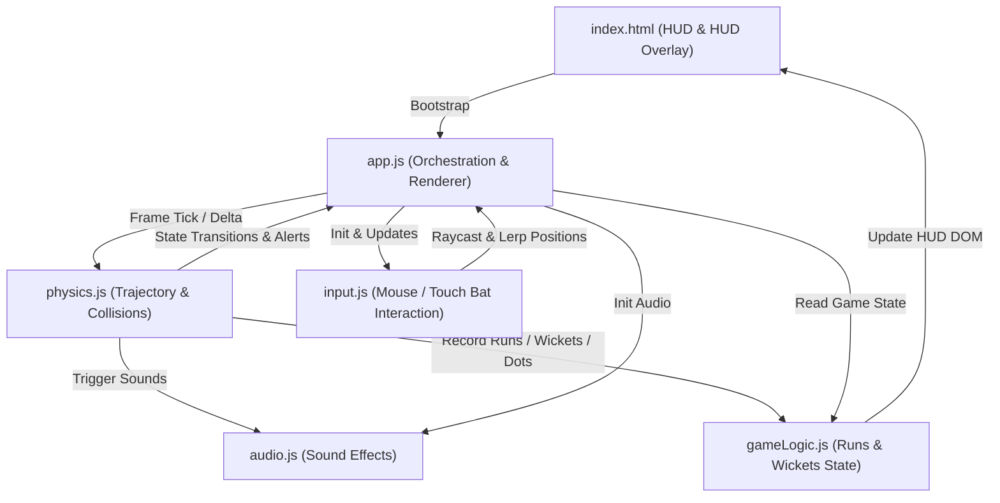

# 🏏 Hyper-3D Cricket: WebGL Championship

A browser-native, high-fidelity 3D cricket simulation built from the ground up using **Three.js** and custom physics engines. Experience realistic ball trajectory, dynamic batting collision, fielders with catch zones, procedural stadium rendering, and immersive audio effects.

**Developer**: Khavish Kumar Palli

---

## 🛠️ Technology Stack

1. **Graphics Render Engine**: **Three.js (r128)**
   - ACES Filmic Tone Mapping for premium photorealism.
   - PCFSoft Shadow Maps for soft, realistic shadows.
   - Bright cyan sky with procedural sun and clouds for daytime atmosphere.
   - Exponential Fog (`THREE.FogExp2`) for atmospheric depth.
2. **Logic & Scripting**: **Modern JavaScript (ES6 Modules)**
   - Modular, decoupled architecture.
   - Zero compilation/bundling overhead (native browser modules).
3. **Styling & HUD**: **Vanilla CSS3 & HTML5**
   - Premium Glassmorphism styling utilizing `backdrop-filter: blur(16px)` and variable-based design systems.
   - Responsive flexbox grids and dynamic CSS animation keyframes.
   - Mobile-optimized layout with touch-friendly controls.
4. **Assets & Textures**: **Procedural Canvas Textures**
   - Pure JS procedural generation for outfield turf stripes, wicket clay textures, and crease markings, ensuring instantaneous load times and zero network overhead.
5. **Audio System**: **Web Audio API**
   - Procedural sound generation for bat hits, wickets, crowd cheers, and ambient stadium noise.
   - No external audio files required - all sounds generated in real-time.

---

## 📐 System Architecture & Module Design

The codebase is organized into highly specialized modules with unidirectional data flow and event-based callbacks to eliminate circular dependencies.



### Module Breakdown

#### 1. [app.js](file:///c:/Users/kurma/OneDrive/Documents/Workspace/3D-Cricket-Game/js/app.js) (Main Orchestrator)
- Manages the Three.js lifecycle (`Scene`, `Camera`, `WebGLRenderer`).
- Builds stadium meshes procedurally (outfield, pitch, boundary ropes, lights, crowd particles).
- Runs the render loop (`requestAnimationFrame`) and distributes elapsed delta time.
- Resolves physically animated wicket shatters when a batsman is bowled out.
- Renders glowing visual effects (ball trails, bat connection sparks, hologram fielders).

#### 2. [physics.js](file:///c:/Users/kurma/OneDrive/Documents/Workspace/3D-Cricket-Game/js/physics.js) (Physics Engine)
- Simulates aerodynamics: gravity, wind resistance, and air drag.
- Resolves pitch bounces using friction and elastic restitution constants.
- Generates spinner delivery drift (off-spin and leg-spin) upon bounce.
- Conducts collision checks in 3D:
  - **Bat connection**: Calculates bat launch angle and exit velocity based on swing timing.
  - **Wicket collision**: Triggers clean-bowled states.
  - **Fielder catch check**: Inspects ball flight path against 3D positions and catch radii of fielders.
  - **Boundary collision**: Resolves fours and sixes.

#### 3. [gameLogic.js](file:///c:/Users/kurma/OneDrive/Documents/Workspace/3D-Cricket-Game/js/gameLogic.js) (State Manager)
- Holds score data (runs, wickets, balls faced, target, high score).
- Performs local storage persistence for player high scores.
- Feeds score metrics and over counts back to the scoreboard HUD DOM.

#### 4. [input.js](file:///c:/Users/kurma/OneDrive/Documents/Workspace/3D-Cricket-Game/js/input.js) (Input Handler)
- Uses raycasting to map 2D screen coordinate movements (mouse or touch drags) onto a 3D plane in front of the wickets.
- Applies linear interpolation (lerp) to bat movements to give them weight and momentum.
- Resolves swing kinematics (backlift, contact point, and follow-through rotation).

#### 5. [audio.js](file:///c:/Users/kurma/OneDrive/Documents/Workspace/3D-Cricket-Game/js/audio.js) (Audio System)
- Implements Web Audio API for procedural sound generation.
- Provides sound effects for: bat hits, wickets breaking, crowd cheers, ball bounces, and ambient stadium noise.
- All sounds generated in real-time without external audio files.

---

## ✨ Visual Features

- **Bright Cyan Sky**: Daytime atmosphere with vibrant blue-cyan sky color
- **Procedural Sun & Clouds**: Dynamically generated sun with glow effect and scattered cloud formations
- **Developer Watermark**: "Khavish Kumar Palli" watermark displayed in the top-left corner
- **Mobile-Optimized UI**: Responsive design with touch-friendly controls and adaptive layouts for mobile devices
- **Glassmorphism HUD**: Modern glass-effect overlays with backdrop blur and smooth animations

---

## 🎮 How to Play

1. **Track and Align**: Move your cursor or slide your finger on the viewport. The cricket bat will follow your pointer in the crease.
2. **Swing**: **Left-click**, press the **Spacebar**, or **tap the screen** to initiate a swing.
3. **Score Boundaries**: Hit the ball away from the stumps. Smash it over the boundary rope (90 meters) to score **6 Runs**, or bounce it past the boundary for **4 Runs**.
4. **Defend Stumps & Fielders**: Prevent the ball from hitting your wickets (Clean Bowled) and avoid hitting aerial shots towards fielders (Caught Out).

---

## 🛠️ Running Locally

Navigate to the project directory and run a local server to resolve ES Module paths:

```bash
# Python Web Server
python -m http.server 8000

# Node.js Server
npx serve
```
Then open the local address (e.g. `http://localhost:8000`) in your web browser.
